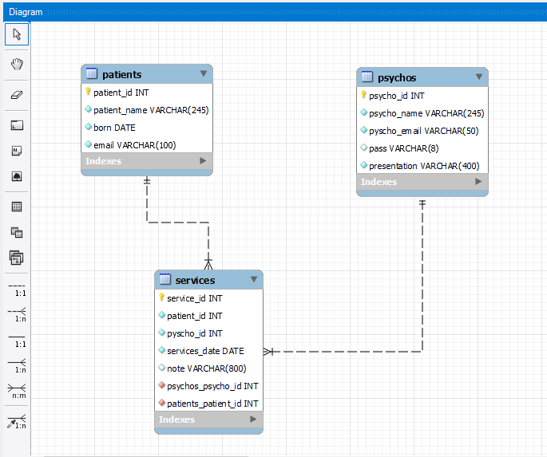
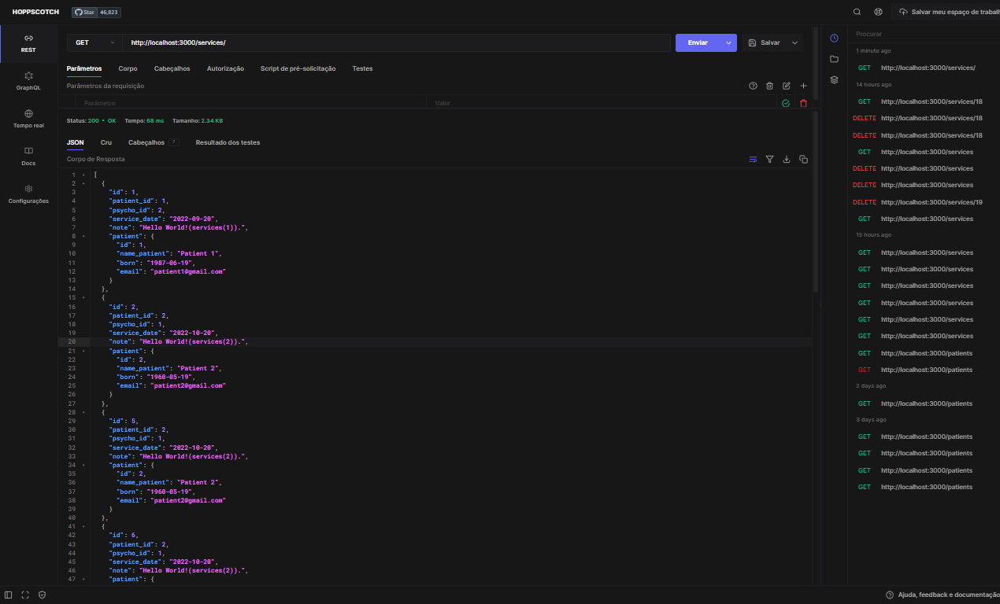
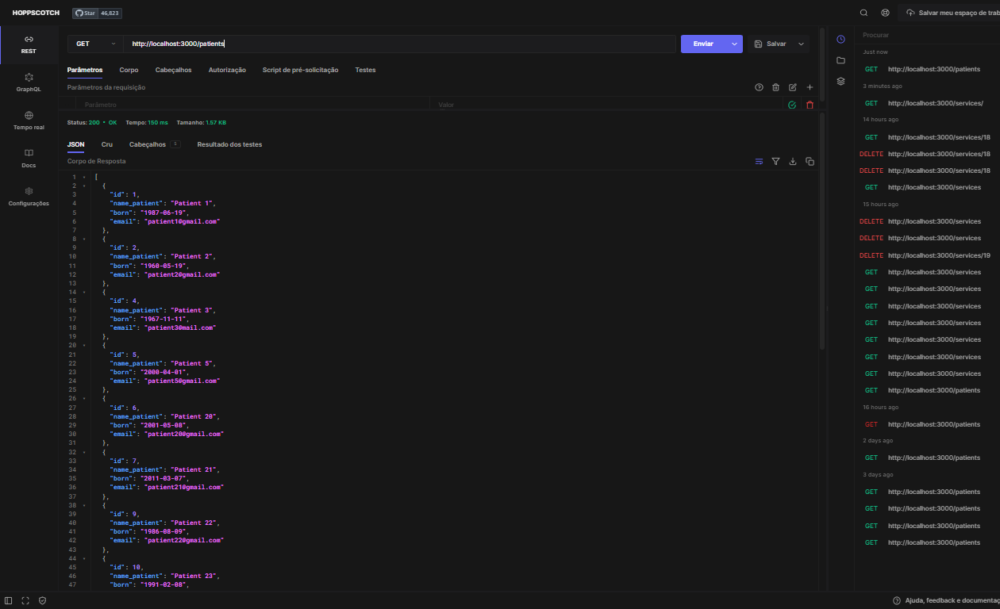
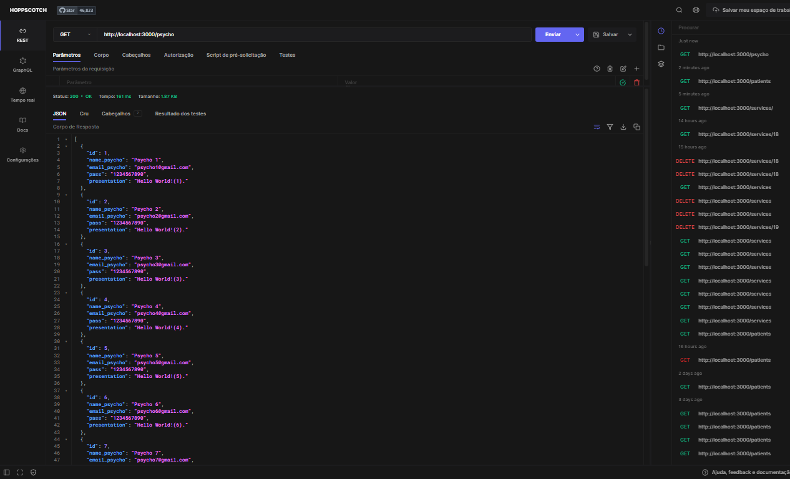

# La_Vie_XP44_G6

<h3>Hands On 3</h3>

<h1>clinica la_vie </h1>
 
 

 

<h2>💻 Sobre o projeto</h2>

Projeto solicitado pela Gama Academy XP44.  
Na qual o objetivo é criar e manipular uma API via GIT e MySQL utilizando das liguagens SQL e JavaScript.   
 Com os dados fornecidos na API, fazer no MVC as requisições de server, rotas, npm.    E via MySQL fazer estruturaçao, atualizaçoes e consultas. 
 E com isso criar um BANCO DE DADOS de uma clinica de psiquiatrica chamada LA VIE saude mental.

 
<h3>✔️ Etapas e funcionalidades:</h3>
 Criar a funcionalidade "Login" utilizando o método POST.
 Criar o CRUD Doutores, que utiliza GET, POST, PUT e DELETE
 Criar o CRUD Pacientes, que utiliza GET, POST, PUT e DELETE
 Criar o CRUD Atendimentos, que utiliza GET e POST.
 Criar a Documentação da API
 Criar um Dashboard 
<h3><strong>Avaliação</strong></h3>
Boas práticas em relação ao uso de JS
Boa organização do projeto usando os princípios do MVC
Validação dos dados que entram na api
Feedback de erros para os usuários
Metodologia Ágil Scrum
Utilizar boas práticas de versionamento de código com Git
<h2>🛠 Tecnologias</h2>
As seguintes ferramentas foram usadas na construção do projeto:

[JavaScript]
[Node]
[Git]
[Express]
[MySQL]
[Banco de Dados]

desevolvido por: 
<a href="https://github.com/jonveigel">Jonathan Veigel</a> 
 

<a href="https://github.com/EduQuaresimin">Eduardo Quaresimin Santos</a> 
 

<a href="https://github.com/danilordev">Danilo Rodrigues </a> 
 

<h3>Segue abaixo Prints e esquemas</h3>
<!--prints -->

